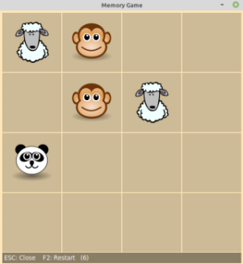
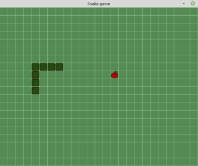

# game2dboard

A quick and easy way to create board games using 2d arrays in Python. 
This Python GUI package provides a graphical user interface (GUI) for 2d arrays (matrix). 

## Installation

Install the latest release by cloning the repository:

```bash
git clone https://github.com/mjbrusso/game2dboard.git 
cd game2dboard
python3 setup.py install --user
```


## Usage

The API is documented [bellow](#API) and within the docstrings. 

This simple example only provides an overview. See the examples for more details.

```python
from game2dboard import Board

def mouse_fn(btn, row, col):
    if btn==1 or btn==4:
        b[row][col] += 1
    else:
        b[row][col] -= 1

b = Board(4, 4)
b.cell_size = 100
b.fill(0)
b.cell_color = "white"
b.grid_color = "black"
b[1][0] = 10
b.on_mouse_click = mouse_fn
b.create_output()
b.print("<left-button>: ++    <right button>: --")
b.show()
```
## Galery


| |   |
|:---:|:---:|
| **Memory Game**<br>54 SLOC<br>[View source](https://github.com/mjbrusso/game2dboard/tree/master/examples/memorygame)| **Snake**<br>87 SLOC<br>[View source](https://github.com/mjbrusso/game2dboard/tree/master/examples/snake) | 


## API

### Creation

- `game2dboard.Board(nrows, ncols)`<br>
Creates a Board.
  - `nrows` : *int* – The number of rows.
  - `ncols` : *int* – The number of columns.


### Properties
- `size` : *int*<br> 
Number of elements in the array (readonly) 


- `nrows` : *int*<br> 
Number of rows in the array (readonly).


- `ncols` : *int*<br> 
Number of columns in the array (readonly).


- `title` : *str*<br> 
Gets or sets the window title.


- `cursor` : *str*<br> 
Gets or sets the mouse cursor shape.<br>
See avaliable cursor names in https://anzeljg.github.io/rin2/book2/2405/docs/tkinter/cursors.html


- `margin` : *int*<br> 
Gets or sets the board margin (px).


- `cell_spacing` : *int*<br> 
Gets or sets the space between cells (px).


- `margin_color` : *str*<br> 
Gets or sets the margin color.


- `cell_color` : *str*<br> 
Gets or sets cells color<br>
See available color names in http://www.science.smith.edu/dftwiki/index.php/Color_Charts_for_TKinter


- `grid_color` : *str*<br> 
Gets or sets grid color


- `cell_size` : *int | (int, int)*<br> 
Gets or sets the cells dimension (*width*, *height*)


- `on_key_press` : *function(key: str)*<br>
Gets or sets the keyboard callback function


- `on_mouse_click` : *function(button: str, row: int, col: int)*<br>
Gets or sets the mouse callback function


- `on_timer` :  *function()*<br>
Gets or sets the timer callback function

### Methods

- `show()`<br>
Create the GUI, display and enter the run loop.


- `start_timer(msecs)`<br>
Start a periodic timer that executes the a function every `msecs` milliseconds<br>
The callback function must be registered using `.on_timer` property.
    - `msecs` (*int*) – Time in milliseconds.


- `stop_timer()`<br>
Stops the current timer.


- `pause(msecs, change_cursor=True)`<br>
Delay the program execution for a given number of milliseconds.<br>
Warning: long pause freezes the GUI!
    - `msecs` (*int*) – Time in milliseconds.
    - `change_cursor` (*bool*) – Change the cursor to “watch” during pause?


- `shuffle()`<br>
Random shuffle all values in the board


- `fill(value, row=None, col=None)`<br>
Fill the board (or a row, or a column) with a value
    - `value` – The value to store
    - `row` (*int*) – Index of row to fill. Default=`None` (all rows)
    - `col` (*int*) – Index of column to fill. Default=`None` (all columns)


- `clear()`<br>
Clear the board, setting all values to `None`.


- `close()`<br>
Close the board, exiting the program.


- `create_output(**kwargs)`<br>
Create a output message bar.
    - `kwargs`:
      - `color` = *str*
      - `background_color` = *str*
      - `font_size` = *int*

- `print(*objects, sep=' ', end='')`<br>
Print message to output bar. <br>
Use like built-in `print()` function.


## TO DO 
To do.... ;-)

## License

game2darray is under MIT license.It can be reused within proprietary software provided that all copies of the licensed software include a copy of the MIT License terms and the copyright notice.
